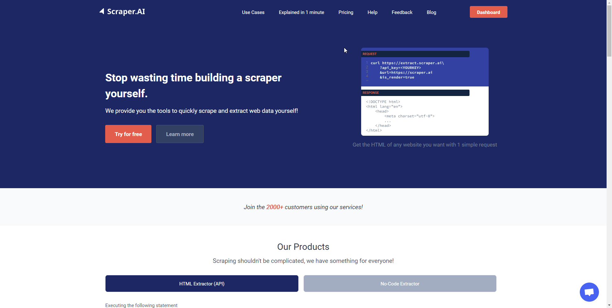

# HTML Extractor - API Key

To connect to our services, we utilize the concept of API Keys to authenticate yourself. These API Keys contain a specific random key as well as your User ID for us to allow you to the services as well as apply the correct rate limits.

To create an API Key, you can simply follow these steps:

1. Open the Scraper.AI Dashboard
2. Navigate to [API](https://scraper.ai/dashboard/profile/api)
3. Click on "Create +" to create an API Key

An example API Key will look like this:

```bash
G1PA%2BMXWVqzbmfkWaNFTKelKFppCh2yhOnjCkE1Hz9%2BA4Y3pw2fYU%2BH%2FTey8wcSaQv5to7Id9E7vvnYLUb%2BAEQuVBL%3D%3D	
```

For more information, see the illustration below.

